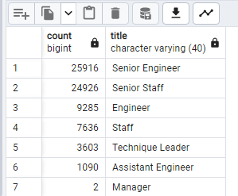
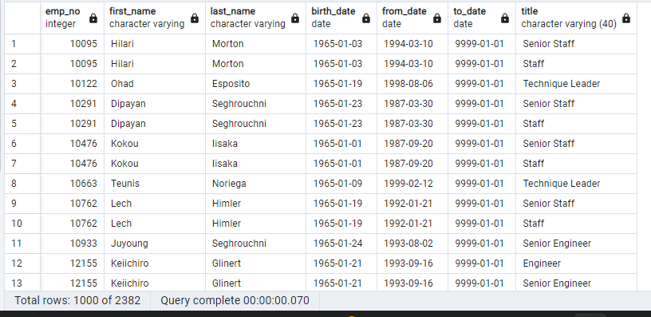

# Pewlett_Hackard_Analysis

## Overview of the analysis
In this project we used SQL to create and combine data bases into new ones to show the information we needed.

## Unique Titles Table (Results) 

## Retiring Titles 

## Mentorship Eligibilty

## Results
- Using the the create a new table function we were able to add a table with Unique Titles
- Using the Join functionw a table was made for Retiring Titles
- Using the multiple inner joins a table was added for Mentorship Elegibilty.
- By using inner join tables are able to combine cleanly.

## Summary
In the end the question was answered of which unique titles there are for each employee, as well as which titles have the most people retiring. 

